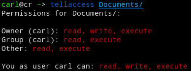

# 10 things Linux

## 1. UNIX - **Recat**

The first thing I wanted to learn more about was UNIX, since Linux is a UNIX-like operating system. I also never really felt that I fully understood what exactly UNIX was, besides being a family of fairly similar operating systems.

The first thing I did was to read the entire Wikipedia page on UNIX. I also read [this](https://people.eecs.berkeley.edu/~brewer/cs262/unix.pdf) original paper written by Dennis Ritchie and Ken Thompson from 1974, which was really interesting though I can’t say I understood all of it. After some more reading and some Youtube videos, I felt comfortable that I understood what UNIX was, and what makes it interesting.
For the project I decided to try and write my first C program. Following the Unix philosophy I made sure that it did one thing only. That thing ended up being a program that reverses the contents of a text file. Since this is just a reverse version of *cat*, I called the program *recat*.

## 2. What is a shell? - **SeaShell**

For this project I was curious to find out what exactly a shell was. Even though it is something that I use often, I was still confused about what differentiates it from the terminal. Turns out it’s really not that complicated. I learned this by rereading the *shell* part of [the paper](https://people.eecs.berkeley.edu/~brewer/cs262/unix.pdf) from the previous project, and some explanations online like [this](https://www.tutorialspoint.com/unix/unix-what-is-shell.htm ) and [this](https://linuxcommand.org/lc3_lts0010.php ). The Unix shell Wikipedia entry was also very informative.

Since this project is about the shell, I found it appropriate to try and write my own. I settled on the name SeaShell, which I found way too funny. It’s not very advanced, but it does the job.

## 3. Ownership and permissions - Tellaccess

This is one of the things that I know is really important for Linux, but have never really understood. I have tried before but never been able to get the knowledge to stick, maybe because I didn't really care about security until now. 

The ownership and permission system turned out to be really intuitive, and I was able to understand the basics from [this](https://www.thegeekdiary.com/understanding-basic-file-permissions-and-ownership-in-linux/) one article. I later discovered [this one](https://linuxhandbook.com/linux-file-permissions/) from Linux Handbook which was more comprehensive.

For the project I decided to create a program that tells you in human readable form, the ownership and permissions of a file. I called the project *tellaccess*, because it tells you who can access the file in what ways.

